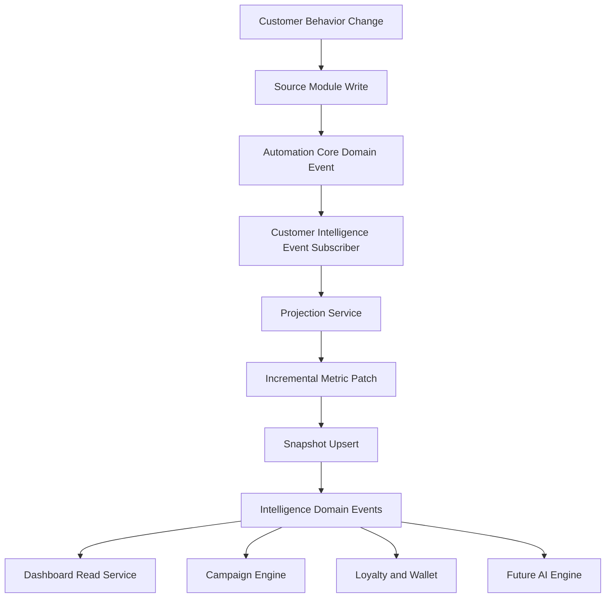
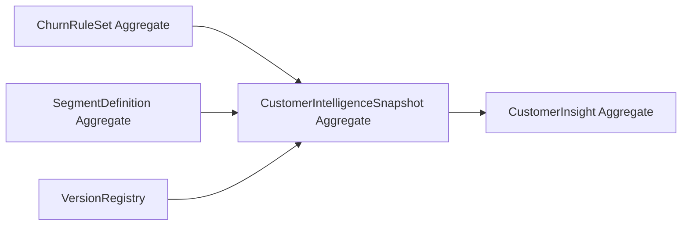
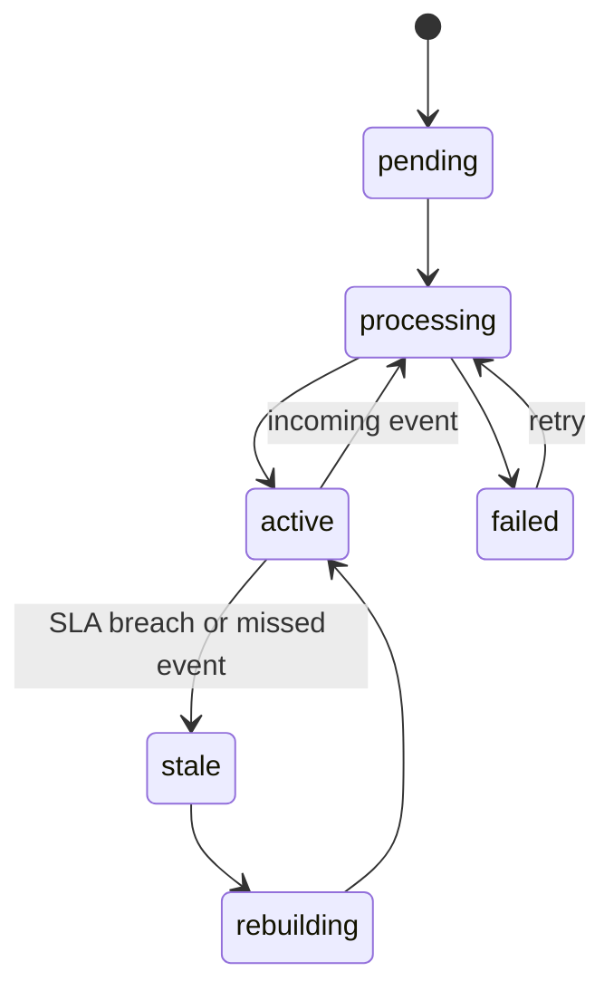

# FoodWave v0.4.0 - Customer Intelligence Engine

Version: v0.4.0  
Phase: 1 - Architecture Design (Revised)  
Date: 2026-07-28

## 1) Architecture Decision Summary

Customer Intelligence is defined as an event-driven materialized projection, not an on-demand analytics engine.

Principle:
- Historical operational tables remain the source of truth.
- Customer Intelligence stores one continuously maintained current snapshot per customer.
- Reads (dashboard, campaigns, automation, loyalty, wallet, future AI) use snapshots, not expensive historical recalculation.

Out of scope for this phase:
- SQL migration scripts.
- Runtime implementation.
- UI screens.

## 2) Revised Module Structure

Module path:
- src/customerIntelligence

Structure:

customerIntelligence/
- contracts/
  - customerIntelligenceContracts.ts
  - projectionContracts.ts
  - refreshContracts.ts
- repositories/
  - customerIntelligenceSnapshotRepository.ts
  - customerInsightRepository.ts
  - churnRulesRepository.ts
  - segmentDefinitionRepository.ts
- services/
  - customerIntelligenceReadService.ts
  - customerIntelligenceProjectionService.ts
  - customerIntelligenceRefreshService.ts
  - customerIntelligenceRebuildService.ts
- calculators/
  - rfmCalculator.ts
  - clvCalculator.ts
  - churnCalculator.ts
  - segmentationCalculator.ts
  - insightGenerator.ts
- events/
  - customerIntelligenceEventTypes.ts
  - customerIntelligenceEventPublisher.ts
  - customerIntelligenceEventSubscriber.ts
- rfm/
  - rfmPolicy.ts
- clv/
  - clvPolicy.ts
- churn/
  - churnPolicyEngine.ts
- segmentation/
  - segmentResolver.ts
- insights/
  - insightCatalog.ts
- types/
  - customerIntelligenceSnapshot.ts
  - customerIntelligenceDtos.ts
  - customerIntelligenceVersions.ts
- utils/
  - dateMath.ts
  - idempotency.ts
  - patchMerge.ts
- index.ts

## 3) Read Model Definition

Customer Intelligence Snapshot is the official read model for behavior intelligence.

Read model contract:
- One active snapshot per organizationId + customerId.
- Includes precomputed RFM, CLV, churn, segment, and insight summary.
- Includes algorithmVersion and snapshotVersion fields for traceability.

Consumer usage:
- Dashboard: consumes aggregate queries over snapshots only.
- Campaign Engine: consumes snapshot fields as campaign condition context.
- Automation Core: consumes intelligence events and snapshot lookup for action context.
- Loyalty: consumes segment/churn/CLV bands to adapt rewards and retention actions.
- Wallet: consumes risk/value indicators for pass update priorities and engagement nudges.
- Future AI modules: consumes stable snapshot schema as feature input without full historical scans.

Read path rule:
- Normal reads must never recalculate intelligence from history.

## 4) Snapshot Strategy

### 4.1 One Active Snapshot per Customer

Logical key:
- organizationId + customerId (unique active record).

Snapshot shape (high level):
- rfm: recencyDays, frequencyCount, monetaryValue, scores.
- clv: historicalValue, averageTicket, visitFrequencyDays, expectedValue, estimatedLifetimeDays.
- churn: probability, riskBand, reasons, churnRuleVersion.
- segmentation: segmentCode, segmentVersion, changedAt.
- insightsSummary: counters and latest insight timestamp.
- projection metadata: algorithmVersion, snapshotVersion, computedAt, lastEventId, lastEventAt.

### 4.2 Refresh Lifecycle

Lifecycle states:
- pending
- processing
- active
- stale
- rebuilding
- failed

Ownership:
- CustomerIntelligenceProjectionService owns incremental snapshot updates.
- CustomerIntelligenceRebuildService owns batch rebuild and repair workflows.

Consistency guarantees:
- At-least-once event consumption with idempotent projection updates.
- Monotonic event application per customer using event timestamp + sequence guard.
- Compare-and-swap update using snapshotVersion to prevent lost updates.
- Eventual consistency SLA defined per organization tier (for example, seconds to minutes).

Why this scales better than on-demand analytics:
- Read complexity becomes $O(1)$ per customer snapshot lookup.
- Dashboards avoid repeated $O(n)$ or $O(n \log n)$ historical calculations.
- Campaign and automation filters operate on indexed projection fields instead of joins over visits/history.

## 5) Event Pipeline

### 5.1 Canonical Flow

### 5.2 Triggering Business Events

Events that can trigger intelligence recalculation:
- customer_created
- customer_updated
- first_visit
- visit_registered
- visit_updated
- visit_archived
- customer_inactive
- customer_returned
- points_earned
- points_redeemed
- reward_available
- level_changed
- wallet_installed
- wallet_updated
- campaign_executed
- campaign_response_recorded

Trigger policy:
- Each event declares affected metric families: rfm, clv, churn, segmentation, insights.
- Projection service recalculates only declared families plus dependent metrics.

## 6) Incremental Refresh Strategy

Incremental projection model:
- Build a metric patch from current snapshot + incoming event payload + minimal source reads.
- Update only impacted fields.

Example partial recomputation map:
- visit_registered:
  - update recencyDays, frequencyCount, monetaryValue
  - update CLV historical/average/frequency
  - reevaluate churn probability and segment
- points_earned or points_redeemed:
  - update loyalty velocity features feeding churn and segment
  - no RFM monetary recompute unless visit payload present
- wallet_installed:
  - update engagement indicators and insight candidates
  - no full CLV recompute

Rules:
- Avoid full historical scans in incremental flow.
- Use pre-aggregated fields where available.
- Fall back to bounded historical read only when required by algorithm policy.

## 7) Batch Rebuild Strategy

Supported rebuild modes:
- Full organization rebuild.
- Nightly maintenance refresh.
- Algorithm upgrade rebuild.
- Data repair rebuild.

Rebuild architecture:
- Chunk customers by organization and ordered customerId cursor.
- Process in bounded batches (for example 500 to 5,000 customers per chunk).
- Use checkpoint table/state for resumability.
- Store per-batch metrics: processed, failed, retried, duration.
- Emit rebuild progress events for observability.

Safety controls:
- Rate limit per organization to protect operational workloads.
- Idempotent reruns per rebuild job id.
- Retry with dead-letter queue for persistent failures.
- Do not block normal incremental updates; apply merge policy with snapshotVersion guards.

## 8) Versioning Strategy

Version dimensions:
- algorithmVersion: semantic version of formulas/policies (for example 1.2.0).
- snapshotVersion: monotonic revision per customer snapshot mutation.
- modelVersion: optional AI scoring model identifier (for future modules).

Compatibility rules:
- Readers must tolerate older algorithmVersion snapshots.
- Rebuild jobs can target specific algorithmVersion.
- New model outputs are additive fields to avoid breaking existing consumers.
- Deprecation window defined before removing old fields.

Upgrade pattern:
- Introduce new calculator policy behind version registry.
- Increment algorithmVersion.
- Rebuild tenant snapshots in controlled batches.

## 9) Domain Events Produced by Customer Intelligence

Projection lifecycle events:
- CustomerIntelligenceSnapshotUpdated
- CustomerIntelligenceSnapshotRebuilt
- CustomerIntelligenceSnapshotRefreshFailed

Business intelligence events:
- CustomerSegmentChanged
- CustomerBecameVIP
- CustomerRecovered
- CustomerAtRisk
- CustomerLost
- CustomerLifetimeValueUpdated
- CustomerChurnDetected
- CustomerHighValueDetected
- CustomerInsightGenerated

Automation Core alignment:
- Each event includes organizationId, customerId, occurredAt, eventId, snapshotVersion, algorithmVersion.
- Event names and payloads follow existing DomainEvent contracts for native subscription by Automation Core.

## 10) Integration Matrix and Ownership Boundaries

| Module | Owns Source Truth | Consumes Snapshot | Emits Trigger Events | Consumes Intelligence Events | Notes |
|---|---|---|---|---|---|
| CRM | customer profile and operational attributes | yes | yes | optional | No intelligence formulas in CRM |
| Customer Visits | visit history and spend facts | no | yes | optional | Canonical visit history |
| Customer Intelligence | projection snapshot and insights | n/a | yes | n/a | Owns all intelligence formulas |
| Automation Core | event transport and orchestration runtime | yes | yes | yes | Contract bridge for all domains |
| Campaign Engine | campaign rules and executions | yes | yes | yes | Conditions read snapshot fields |
| Wallet | wallet pass lifecycle | yes | yes | yes | Uses value/risk for engagement |
| Loyalty | points, levels, rewards | yes | yes | yes | Uses segment/churn guidance |
| Dashboard | read APIs and visualization backend | yes | no | optional | Never recalculates intelligence |
| Future AI Engine | AI models and recommendations | yes | yes | yes | Uses snapshot as stable feature layer |

Ownership guardrail:
- Only Customer Intelligence module owns intelligence scoring and segmentation formulas.

## 11) Aggregate Diagram

Aggregate notes:
- Snapshot aggregate is the primary read model.
- Insight aggregate stores generated actionable outcomes.
- Rule and segment aggregates are versioned policy inputs.

## 12) Snapshot Lifecycle Diagram

## 13) Scalability Review

### 13.1 Organization Size: 10,000 Customers

Expected posture:
- Single-tenant incremental updates are low risk with proper indexes.

Likely bottlenecks:
- Burst events during peak service hours.

Optimizations:
- Event consumer concurrency caps.
- Per-customer idempotency keys.

### 13.2 Organization Size: 100,000 Customers

Expected posture:
- Requires strict partitioning by organization and customer key range for rebuilds.

Likely bottlenecks:
- Rebuild duration and lock contention.
- Hotspot customers with frequent event bursts.

Optimizations:
- Batch checkpoints and resumable jobs.
- Write coalescing window per customer (short debounce).
- Read replicas for heavy dashboard queries.

### 13.3 Organization Size: 1,000,000 Customers

Expected posture:
- Large-scale tenants require distributed workers and queue-based orchestration.

Likely bottlenecks:
- Projection write throughput.
- Event lag under burst load.
- Snapshot index growth and vacuum pressure.

Optimizations:
- Horizontal worker scaling.
- Queue partitioning by organizationId hash.
- Snapshot table partitioning strategy by organization/time.
- Periodic compaction and archival strategy for historical insight/event logs.

Scalability conclusion:
- Materialized projection architecture is mandatory at this scale; on-demand full-history analytics will not meet latency and cost targets.

## 14) Risk Assessment

1. Risk: duplicate ownership between historical aggregates and projection values.
- Mitigation: define clear ownership contract; projection is read model only, history remains source truth.

2. Risk: event ordering and race conditions per customer.
- Mitigation: sequence guards, snapshotVersion compare-and-swap, idempotency keys.

3. Risk: stale snapshots under consumer outages.
- Mitigation: stale-state detection, retry queues, nightly repair rebuild.

4. Risk: algorithm changes causing inconsistent tenant behavior.
- Mitigation: version registry, controlled rollout, targeted rebuild jobs.

5. Risk: high rebuild cost for large organizations.
- Mitigation: chunked processing, resumable checkpoints, throttling and backpressure.

## 15) Phase Gate

Phase 1 Revised Architecture Review is complete with:
- Updated architecture.
- Aggregate diagram.
- Event flow.
- Snapshot lifecycle.
- Integration matrix.
- Scalability analysis.
- Risk assessment.

No database design or migration work is included in this revision.

Status: Waiting for approval before Phase 2 Database Design.
