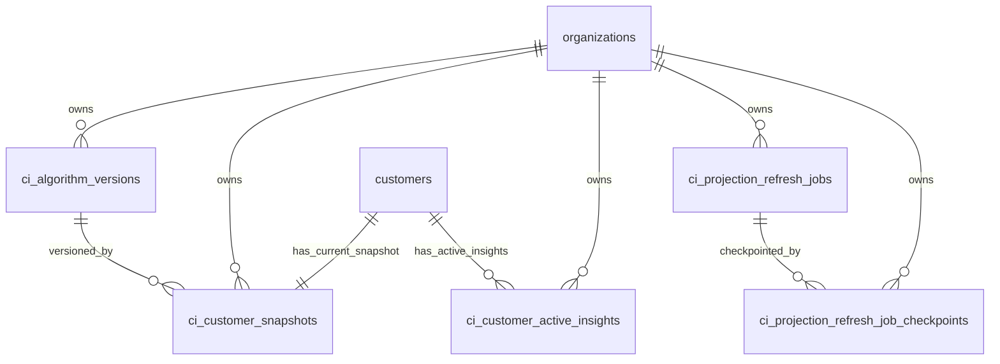

# FoodWave v0.4.0 - Phase 2: Projection Store Database Design

Version: v0.4.0  
Phase: 2 - Database Design (Projection Store)  
Date: 2026-07-28

## 1) Mandatory Schema Audit (Completed)

This audit was completed before proposing new entities.

### 1.1 Existing Domain Tables Reviewed

CRM and Customer Visits:
- `customers`
- `customer_visits`

Loyalty:
- `loyalty_configs`
- `customer_levels`
- `loyalty_wallets`
- `loyalty_rewards`
- `loyalty_transactions`
- `reward_history`

Wallet:
- `wallet_cards`
- `wallet_passes`
- `wallet_pass_sync_events`

Campaigns and Automation Runtime Storage:
- `campaigns`
- `campaign_triggers`
- `campaign_conditions`
- `campaign_actions`
- `campaign_templates`
- `campaign_executions`
- `campaign_queue`
- `campaign_logs`

Tenant and access backbone:
- `organizations`
- `organization_memberships`
- `restaurants`
- `restaurant_memberships`
- `profiles`

### 1.2 Existing Customer Intelligence Objects Found

No dedicated projection-store tables currently exist.

Existing intelligence-like fields already on `customers`:
- `customer_score`
- `customer_status`
- `marketing_segment`
- `average_ticket`
- `lifetime_value`
- `lifecycle_status`

Existing trigger/function:
- `update_customer_business_metrics()`
- trigger `trg_update_customer_business_metrics`

These objects currently mix operational customer data with derived intelligence.

### 1.3 Existing Triggers, Views, Indexes, and RLS

Triggers:
- `trg_update_customer_business_metrics` on `customers`
- touch/update triggers across loyalty, campaign, wallet pass, and base entities

Views:
- No SQL views detected for customer intelligence projection.

Indexes:
- Strong organization/customer indexes exist on `customer_visits`, loyalty, wallet, and campaign tables.

RLS:
- Existing pattern is organization-membership-based access control for org-scoped tables.

### 1.4 Reuse Opportunities

Reusable keys and boundaries:
- `organization_id`, `customer_id` FKs
- existing organization membership RLS policy pattern
- existing event-driven campaign/automation architecture

Reusable source-of-truth data:
- Visit behavior from `customer_visits`
- Loyalty state from `loyalty_wallets` and `loyalty_transactions`
- Wallet engagement from `wallet_passes`/`wallet_pass_sync_events`
- Campaign interaction context from `campaign_executions`

### 1.5 Duplication Risks Identified

1. Duplicating transactional history in projection tables.
- Prohibited. Projection store must not replicate visits, wallet sync logs, loyalty transactions, or campaign execution history.

2. Dual ownership of intelligence fields between `customers` and projection snapshot.
- High risk of drift.
- Mitigation: projection store becomes the official intelligence read model; `customers` remains operational profile with optional compatibility mirror during transition.

3. Recomputing intelligence on reads.
- Violates architecture and does not scale.
- Mitigation: event-driven incremental snapshot updates only.

## 2) Projection Store ERD

Cardinality:
- One organization has many snapshots.
- One customer has exactly one current snapshot.
- One customer can have zero or many active insights.
- One algorithm version can be used by many snapshots.
- One refresh job can have many checkpoints.

Ownership:
- Projection tables are owned by Customer Intelligence module.
- Source transactional tables remain owned by their native modules.

Read responsibilities:
- `ci_customer_snapshots` is the primary read model for intelligence consumers.
- `ci_customer_active_insights` serves actionable insight feeds.
- job/checkpoint tables are operational control plane only.

## 3) Projection Store Table Design (Purpose, Why, Lifecycle)

### 3.1 `ci_customer_snapshots`

Purpose:
- Single authoritative, current intelligence state per customer.

Why it exists:
- Enables constant-time reads for dashboard, campaigns, automation, loyalty, wallet, and AI consumers.
- Eliminates expensive re-aggregation from historical tables during reads.

Owner:
- Customer Intelligence projection pipeline.

Lifecycle:
- Created on first eligible customer event.
- Updated incrementally on behavior events.
- Never deleted while customer exists; marked stale/rebuilding/failed via status fields when needed.

Update strategy:
- Event-driven upsert with optimistic version increment (`snapshot_version`).
- Idempotent updates keyed by last processed source event identity.

Retention strategy:
- Persistent current-state record.
- No historical snapshot copies in this table.

Consumers:
- Dashboard, Campaign Engine, Automation Core, Loyalty, Wallet, Future AI.

### 3.2 `ci_customer_active_insights`

Purpose:
- Stores current actionable insights attached to a customer snapshot.

Why it exists:
- Keeps recommendation and alert consumption read-optimized without scanning event history.

Owner:
- Customer Intelligence insight generator.

Lifecycle:
- Insert when insight becomes active.
- Resolve/archive when condition no longer holds or action completed.

Update strategy:
- Diff-based refresh from previous snapshot to new snapshot.
- Upsert by deterministic insight key.

Retention strategy:
- Keep active + recently resolved insights (bounded retention window) for UX continuity.
- Long-term historical analytics remains outside projection scope.

Consumers:
- Dashboard feed, campaign suggestion layer, automation handlers, future AI recommendation orchestration.

### 3.3 `ci_algorithm_versions`

Purpose:
- Registry of scoring/model versions used by snapshots.

Why it exists:
- Guarantees reproducibility and safe upgrades.
- Supports parallel evolution of rules/models without breaking old snapshots.

Owner:
- Customer Intelligence release governance.

Lifecycle:
- New row per released algorithm/model version.
- Old versions remain queryable until deprecated.

Update strategy:
- Append-only version registration.

Retention strategy:
- Retain all versions for auditability and controlled rollback.

Consumers:
- Projection pipeline, rebuild jobs, operations, future AI model registry bridge.

### 3.4 `ci_projection_refresh_jobs`

Purpose:
- Control-plane table for rebuild, maintenance, and repair operations.

Why it exists:
- Enables resumable, observable, and safe large-scale projection rebuilds.

Owner:
- Customer Intelligence rebuild orchestrator.

Lifecycle:
- Created when rebuild/repair/upgrade job starts.
- Transitions through queued/running/completed/failed/canceled.

Update strategy:
- Worker updates aggregate progress metrics and status.

Retention strategy:
- Time-bounded retention (for example 30-90 days) for operational audits.

Consumers:
- Internal operations and platform health dashboards.

### 3.5 `ci_projection_refresh_job_checkpoints`

Purpose:
- Fine-grained progress and resume markers for each job partition/chunk.

Why it exists:
- Prevents full restart after failures on large tenants.

Owner:
- Rebuild workers.

Lifecycle:
- Created per chunk/partition in a job.
- Updated with cursor, counters, and retry metadata.

Update strategy:
- Frequent worker writes with checkpoint cursor advancement.

Retention strategy:
- Align with parent job retention; purge with job cleanup.

Consumers:
- Rebuild engine and operational tooling only.

## 4) Snapshot Model Design

Current snapshot semantics:
- Exactly one active row per `organization_id + customer_id`.
- Unique constraint enforces singularity.

Versioning fields:
- `snapshot_version`: monotonic integer/bigint increment every successful update.
- `algorithm_version_id`: FK to `ci_algorithm_versions`.
- `model_version` (nullable): reserved for future ML scoring models.

Freshness and consistency fields:
- `refreshed_at`: last successful projection update timestamp.
- `last_source_event_id`: idempotency/event ordering guard.
- `last_source_event_at`: ordering watermark.
- `projection_status`: active/stale/rebuilding/failed.

Consistency model:
- Eventual consistency with strict per-customer monotonic update ordering.
- At-least-once event processing, exactly-once effect by idempotent event guards.
- Compare-and-swap on `snapshot_version` prevents lost updates.

Update ownership:
- Only projection pipeline writes intelligence fields.
- Downstream modules are read-only consumers of snapshot intelligence.

## 5) Refresh Strategy

Realtime updates:
- Triggered by domain events (visit, loyalty, wallet, campaign/customer behavior changes).
- Pipeline computes only impacted metric families and applies incremental patch.

Deferred updates:
- Failed or rate-limited events are queued for retry without blocking source transactions.

Partial recomputation:
- Event-to-metric mapping controls recalculation scope.
- Example: wallet event updates engagement/churn features, not full RFM.

Full recomputation:
- Reserved for rebuild modes (algorithm upgrades, backfills, repairs, large drift correction).

Batch rebuild:
- Organization-scoped chunk processing with checkpoints and resumable cursors.

Repair process:
- Targeted customer or segment-level rebuild using same job framework.
- Used for stale snapshots, dead-letter recoveries, or consistency alarms.

## 6) Multi-Tenant Isolation Strategy

Organization isolation:
- All projection tables are organization-scoped with mandatory `organization_id`.
- FKs to `organizations` and `customers` enforce tenant consistency.

RLS model:
- Mirror existing Supabase policy pattern:
  - allow access when `organization_id` belongs to caller membership in `organization_memberships` with active/non-deleted membership.

Tenant boundaries:
- Unique keys include `organization_id` to prevent cross-tenant collisions.
- Rebuild jobs and checkpoints are tenant-aware and cannot cross organizations.

Index strategy:
- Core lookup:
  - `(organization_id, customer_id)` unique on snapshots.
- Hot dashboard filters:
  - `(organization_id, segment_code)`
  - `(organization_id, churn_risk_band)`
  - `(organization_id, clv_band)`
  - `(organization_id, refreshed_at desc)`
- Insight feed:
  - `(organization_id, status, severity, updated_at desc)`
- Job control:
  - `(organization_id, status, created_at desc)` on jobs
  - `(job_id, checkpoint_status)` on checkpoints

## 7) Performance and Scale Strategy

### 7.1 10,000 Customers

Expected behavior:
- Snapshot reads are low-latency indexed lookups.
- Realtime writes remain manageable with moderate event volume.

Hot paths:
- dashboard segment and churn distribution
- campaign customer targeting predicates

Write amplification:
- one event may update snapshot + 0..n active insights

Optimization focus:
- strict event idempotency
- covering indexes for primary read predicates

### 7.2 100,000 Customers

Expected behavior:
- Rebuild throughput and queue backpressure become primary constraints.

Hot paths:
- organization-wide leaderboard/ranking reads
- concurrent campaign filters during peak windows

Read amplification risk:
- if filters hit many unindexed JSON fields

Optimization focus:
- keep frequently filtered fields as typed scalar columns
- chunked rebuild with checkpointing and bounded concurrency
- optional read replica for dashboard-heavy workloads

### 7.3 1,000,000 Customers

Expected behavior:
- requires disciplined partitioning and worker scaling.

Bottleneck risk:
- write contention on hot tenants
- index bloat and vacuum pressure
- event lag under burst traffic

Optimization focus:
- queue partitioning by organization hash
- table partition strategy for snapshots and insights (by organization hash or time+tenant strategy)
- asynchronous insight materialization for non-critical insights
- aggressive observability on lag, retries, and drift

Storage growth estimate guidance:
- Snapshot row is compact current state; growth is linear with customer count.
- Insight table growth is bounded by active/recent retention policy.
- Job/checkpoint storage is operational and short retention.

## 8) Future Evolution Design

The schema supports new models without breaking existing snapshots by:
- Version registry (`ci_algorithm_versions`) with compatibility metadata.
- Extensible snapshot payload areas for model-specific outputs.
- Stable scalar columns for common filters plus structured JSON for evolving attributes.
- Nullable/additive fields for AI predictions and recommendation scores.

Planned extension compatibility:
- New scoring models
- New segmentation engines
- AI propensity/churn/recommendation models
- Behavioral graph-based features

Backward compatibility rule:
- additive schema evolution first, destructive removals only after dual-read deprecation window.

## 9) Migration Strategy (No SQL Yet)

### 9.1 Migration Order

1. Create version registry table (`ci_algorithm_versions`).
2. Create snapshot table (`ci_customer_snapshots`) with constraints and base indexes.
3. Create active insights table (`ci_customer_active_insights`) with indexes.
4. Create rebuild job and checkpoint tables.
5. Enable RLS and add organization-membership policies for all projection tables.
6. Backfill initial snapshots via controlled batch job (not in migration SQL).
7. Switch read consumers progressively to snapshot read model.
8. Keep compatibility read fields in `customers` during transition; plan deprecation later.

### 9.2 Dependencies

- Requires existing `organizations`, `customers`, and `organization_memberships`.
- Requires existing event publication paths from CRM/Visits/Loyalty/Wallet/Campaign.

### 9.3 Backward Compatibility

- Do not remove existing customer intelligence-related columns immediately.
- Introduce projection store as side-by-side source until consumers migrate.

### 9.4 Deployment Sequence

- Deploy schema first.
- Run backfill/rebuild job.
- Enable read-path cutover by module in controlled phases.
- Enable event-driven projection updates as default write path.

### 9.5 Rollback Strategy

- If projection issues occur, consumers can temporarily fall back to existing customer derived fields.
- Keep old fields untouched until projection SLAs are proven.

### 9.6 Zero-Downtime Considerations

- Additive schema changes only.
- No blocking table rewrites on high-traffic tables.
- Background backfill with throttled chunks.
- Feature-flagged consumer cutover.

## 10) Risks and Mitigations

1. Projection inconsistency from out-of-order events.
- Mitigation: event watermark (`last_source_event_at`) + idempotency key (`last_source_event_id`) + optimistic `snapshot_version` control.

2. Race conditions on same customer burst events.
- Mitigation: per-customer serialized processing or conflict-retry on version mismatch.

3. Data drift between snapshot and source truth.
- Mitigation: nightly drift detection and targeted repair jobs.

4. Large rebuild operational impact.
- Mitigation: chunked jobs, checkpoints, throttling, dead-letter retry queues.

5. Read path degradation at 1M scale.
- Mitigation: selective denormalized scalar columns, index tuning, partitioning strategy, read replicas.

6. Dual ownership confusion during transition.
- Mitigation: explicit ownership contract and phased deprecation of customer intelligence write ownership outside projection service.

## 11) Production-Readiness Decision

This Phase 2 design is production-oriented and aligned with:
- Materialized Projection pattern
- Event-driven architecture
- Multi-tenant isolation with Supabase RLS
- No duplication of transactional histories
- Scalable read-optimized customer intelligence consumption

No SQL migrations are generated in this phase.

Status: waiting for approval before writing migration SQL.
